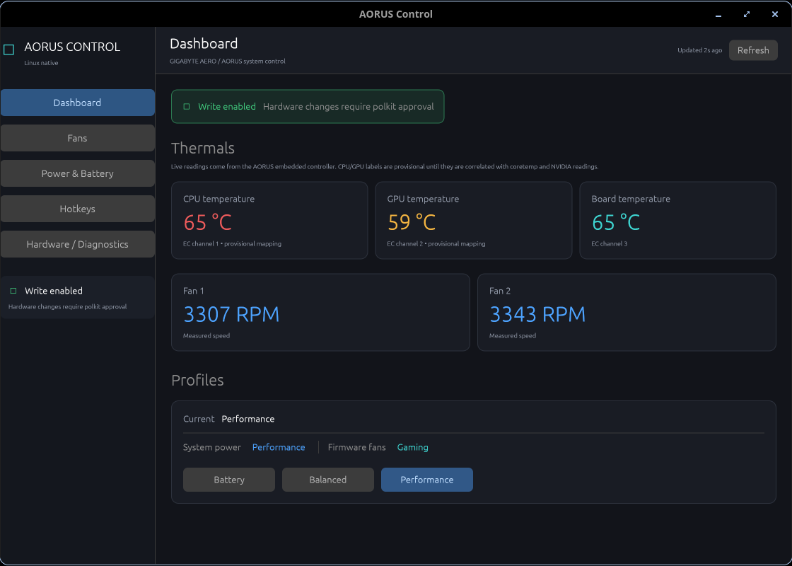
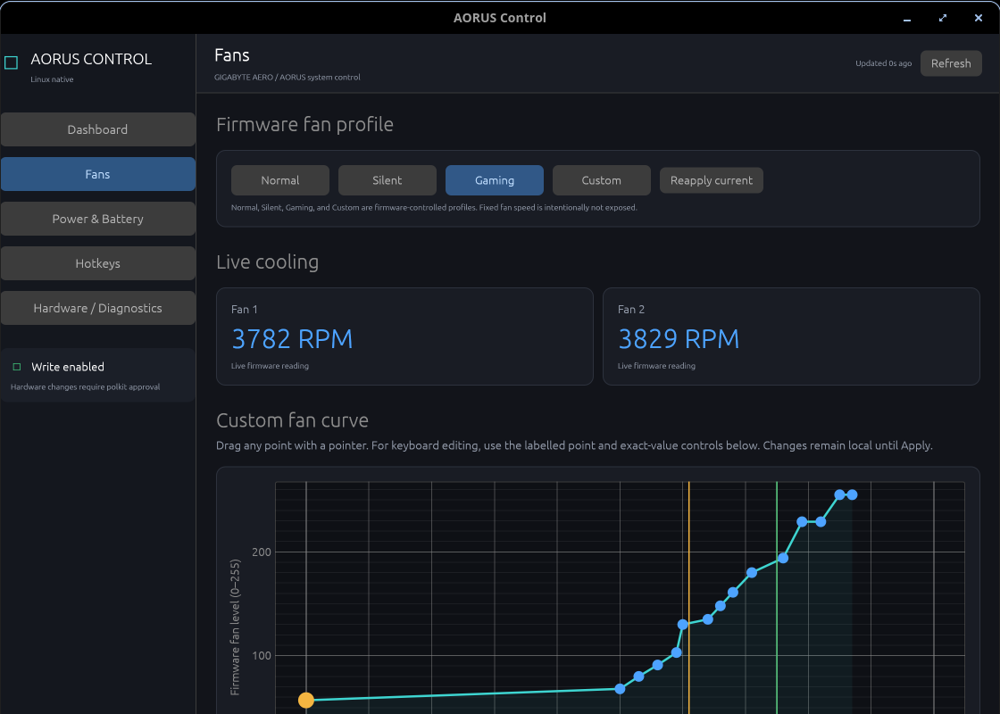
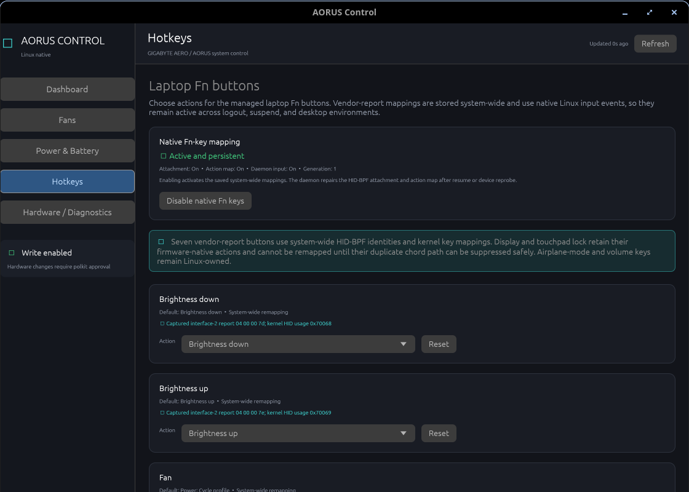
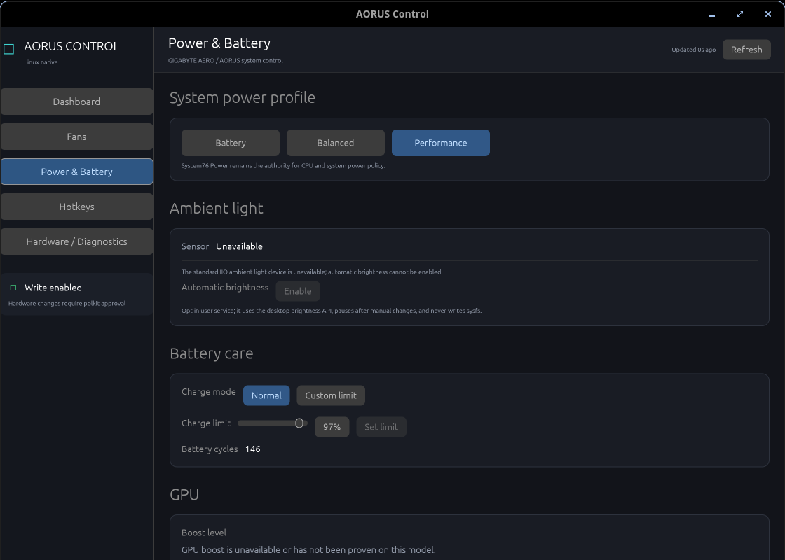

# AORUS Control for Linux

[](https://github.com/Jordan-Jarvis/aorus-control/actions/workflows/check.yml)
[](https://github.com/Jordan-Jarvis/aorus-control/actions/workflows/release.yml)

Native fan, power, temperature, battery, and laptop Fn-key controls for
supported GIGABYTE/AORUS laptops. The privileged Rust daemon runs
independently of the desktop; the native Rust UI is optional.

> **Compatibility warning:** The only fully verified model is the **GIGABYTE
> AERO 16 YE5 (`P86VE`)**. Other GIGABYTE/AORUS laptops may install and show a
> warning, but hardware writes and the native Fn-key fix stay disabled unless
> the model and HID report descriptor match a verified profile. If you try it
> on another laptop, please report which features work and which do not.

## Install the current release

For Ubuntu/Pop!_OS 24.04 on 64-bit Intel/AMD systems:

```sh
curl -fLO https://github.com/Jordan-Jarvis/aorus-control/releases/download/v0.1.1/aorus-control_0.1.1-1_amd64.deb
sudo apt install ./aorus-control_0.1.1-1_amd64.deb
```

`apt` installs the package's runtime dependencies and starts the system
daemon. The package is write-enabled by default and installs and maintains the
native Fn translation automatically. The mappings are available in
**Hotkeys → Laptop Fn buttons**.

The optional ambient-light package is separate:

```sh
curl -fLO https://github.com/Jordan-Jarvis/aorus-control/releases/download/v0.1.1/aorus-control-als-dkms_0.1.1-1_all.deb
sudo apt install ./aorus-control-als-dkms_0.1.1-1_all.deb
```

It needs DKMS and matching kernel headers. Ambient-light support is only
verified on the AERO 16 YE5; automatic brightness is enabled from the Power &
Battery screen.

## What is supported

On the verified AERO 16 YE5, the application provides:

- Normal, Silent, Gaming, and Custom **fan profiles**;
- a validated 15-point temperature/fan curve editor;
- CPU/GPU temperature and fan-RPM telemetry;
- system power-profile synchronization and a brief profile-change indicator;
- battery charge mode and charge-limit controls;
- capability-detected GPU boost and USB charging controls;
- a native desktop UI, tray icon, CLI, and resident system daemon; and
- native, system-wide Fn handling through HID-BPF.

Fan control is profile-based. The software does not hard-code a fan speed or
write `fan_custom_speed` during normal operation.

### Fn buttons

The verified native path can remap these seven vendor-report buttons to
supported standard actions, AORUS fan/power actions, **Run custom command**, or
**Disabled**:

- brightness down and up;
- fan/Gaming;
- Zz/sleep;
- Wi-Fi;
- Square-X; and
- AI.

LCD/display, touchpad-lock, airplane mode, and physical volume buttons remain
under their existing firmware or Linux handling. They are not remappable by
this release. Fn mappings remain active when the UI is closed, after logout,
and after suspend or HID reprobe. Desktop-specific actions such as opening an
app or taking a screenshot still require an active graphical session.
For **Run custom command**, enter one command in the Hotkeys screen and test it
there. It runs as the logged-in desktop user through the resident UI, not as
root, and needs an active graphical session.

## Screenshots

The screenshots below show the native Rust UI: live telemetry and profiles,
the editable 15-point fan curve, system-wide Fn mappings, and power/battery
controls.

<p></p>

<p></p>

<p></p>

<p></p>

## Compatibility and limitations

The main package is intended for Ubuntu/Pop!_OS 24.04 on `amd64`. It requires
Linux with:

- systemd, D-Bus, polkit, and udev;
- the `aorus_laptop` kernel driver from
  [gigabyte-laptop-wmi](https://github.com/tangalbert919/gigabyte-laptop-wmi)
  (the main package includes the pinned DKMS source and installer);
- X11 or XWayland with `DISPLAY` for the desktop UI; and
- a StatusNotifierItem tray host to reopen a hidden window.

The daemon and native Fn path do not require a logged-in user or a particular
desktop environment. The optional COSMIC shortcut integration is desktop
specific. The current UI does not support a pure Wayland window without
XWayland.

The package does not silently compile or load a kernel module during `apt
install`. If the AORUS WMI driver is missing, open **Hardware / Diagnostics**
and use **Install AORUS WMI driver**. The UI shows the privileged installer
progress and installs the bundled, pinned DKMS source for the running kernel.
The same flow is available for the ambient-light driver from **Power & Battery**.
Kernel headers and DKMS are required for these driver installations; Secure
Boot may require enrolling a DKMS signing key before a module can load.

## After installation

Launch **AORUS Control** from the application menu. The window's close button
hides it to the tray; tray **Quit** exits the UI. Fan control and Fn handling
continue through `aorusd` after the UI exits.

Useful checks:

```sh
aorusctl status
aorusctl fn status
```

Configuration is stored in:

| Path | Purpose |
| --- | --- |
| `/etc/aorus-control/config.toml` | System fan/profile configuration |
| `/etc/aorus-control/fn-buttons.toml` | System-wide Fn actions |
| `/etc/aorus-control/fn-command.toml` | Custom commands used by mapped Fn buttons |
| `~/.config/aorus-control/auto-brightness.toml` | Optional user brightness policy |

## Uninstall

For the Debian package:

```sh
sudo apt remove aorus-control
```

This stops the daemon and removes integration files while preserving the
configuration directory. Remove the optional ALS package separately if it was
installed:

```sh
sudo apt remove aorus-control-als-dkms
```

## Build from source

Source builds are for developers or distributions without a matching package.
They need Rust, a C toolchain, Clang, libbpf, libelf, libudev, pkg-config, and
matching kernel headers:

```sh
sudo apt-get install -y build-essential clang git libbpf-dev libelf-dev libudev-dev pkg-config "linux-headers-$(uname -r)"
git clone https://github.com/Jordan-Jarvis/aorus-control.git
cd aorus-control
cargo build --release --locked
./tools/brightness-hid-bpf-loader-build.sh
sudo ./install.sh
```

The source installer uses `/usr/local`, enables and starts `aorusd`, and never
invokes `sudo` itself. Use `DESTDIR=/path/to/staging ./install.sh` to stage an
installation without changing the running system. Developers can run the
non-destructive suite with `./tools/check.sh`.

## CLI examples

```sh
aorusctl status
aorusctl diagnostics
aorusctl profile performance
aorusctl fan gaming
aorusctl fan reapply
aorusctl curve show
aorusctl mappings get
aorusctl fn list
aorusctl fn set brightness-down disabled
```

Mutating commands use the daemon's typed D-Bus API and polkit; the CLI does
not write sysfs directly.

## Reporting compatibility results

Please report the laptop model, Linux distribution, kernel version, and which
features work. These commands provide useful diagnostics:

```sh
uname -a
cat /sys/class/dmi/id/product_name /sys/class/dmi/id/product_version
aorusctl status
aorusctl fn status
```

For Fn failures, also attach relevant lines from:

```sh
journalctl -u aorusd.service -n 100 --no-pager
```

Do not remove the exact-model safety checks to force support for an unverified
laptop. See [docs/brightness-debug.md](docs/brightness-debug.md) for the
read-only and guarded diagnostic procedures.

## More documentation

- [Changelog](CHANGELOG.md)
- [Native Fn-key implementation](brightness/README.md)
- [Ambient-light module](brightness/als/README.md)
- [D-Bus API](docs/dbus-api.md)
- [Hardware baseline](docs/hardware-baseline.md)
- [Fn-key diagnostics](docs/brightness-debug.md)
- [Fn reliability implementation record](docs/fn-input-reliability-plan.md)

## License

The Rust application is licensed under the [MIT License](LICENSE). The native
kernel components carry their own GPL SPDX license notices; see
[THIRD-PARTY-NOTICES.md](THIRD-PARTY-NOTICES.md).
